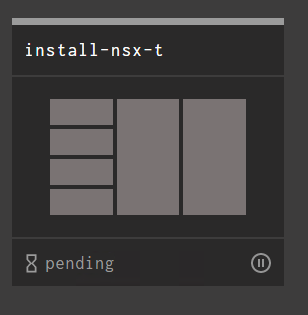

# Concourse Installation and Setup

## Overview

Concourse is an Open source CI/CD pipeline tool used to perform Day 1 and 2 Ops on the CNA platform.
The NSX-T Pipeline was created to allow our customers a simple way to deploy NSX-T end to end in a click of a button and to create a repeatable deployment process.

## Concourse Setup

Concourse can be stoodup in many different ways. In this tutorial we will stand it up using a combination of docker images with docker-compose.

### Prereq's:

- Ubuntu 16.04 or later
- Docker 18.06 or later
- Docker-compose
- Git
- Fly


1. Clone this repo

    `git clone https://github.com/nvpnathan/concourse-nsxt.git`

2. Make [generate-keys.sh](generate-keys.sh) file executable

    `cd concourse-nsxt && chmod +x generate-keys.sh`
    
3. Generate keys for Concourse by executing the `generate-keys.sh` file. This will create a keys directory inside of concourse-nsxt.

    `./generate-keys.sh`

4. Edit the domain name and DNS server parameters in the docker-compose file Look for the **CHANGEME** parameters. This will need to match the host that you are running concourse on and the DNS server that can resolve things like vCenter and the outside world.

```
version: '3'

services:
  concourse-db:
    image: postgres
    environment:
    - POSTGRES_DB=concourse
    - POSTGRES_PASSWORD=concourse_pass
    - POSTGRES_USER=concourse_user
    - PGDATA=/database

  concourse-web:
    image: concourse/concourse:4.2.1
    command: web
    links: [concourse-db]
    depends_on: [concourse-db]
    ports: ["8080:8080"]
    volumes: ["./keys/web:/concourse-keys"]
    environment:
    - CONCOURSE_POSTGRES_HOST=concourse-db
    - CONCOURSE_POSTGRES_USER=concourse_user
    - CONCOURSE_POSTGRES_PASSWORD=concourse_pass
    - CONCOURSE_POSTGRES_DATABASE=concourse
    - CONCOURSE_EXTERNAL_URL=http://CHANGEME:8080/
    - CONCOURSE_ADD_LOCAL_USER=nsx:vmware
    - CONCOURSE_MAIN_TEAM_ALLOW_ALL_USERS=true

  concourse-worker:
    image: concourse/concourse:4.2.1
    command: worker
    privileged: true
    links: [concourse-web]
    depends_on: [concourse-web]
    volumes: ["./keys/worker:/concourse-keys"]
    environment:
    - CONCOURSE_TSA_HOST=concourse-web:2222
    - CONCOURSE_GARDEN_NETWORK
    - CONCOURSE_GARDEN_DNS_SERVER=CHANGEME

  nginx:
    image: nginx:stable-alpine
    container_name: nginx
    volumes:
     - /root/nsxt/:/var/www/html/
    #- ./nginx/conf.d:/etc/nginx/conf.d
    #- ./nginx/vhost.d:/etc/nginx/vhost.d
     - /root/nsxt/:/usr/share/nginx/html
    #- ./nginx/certs:/etc/nginx/certs:ro
    #- ./nginx/proxy.conf:/etc/nginx/proxy.conf:ro
    ports:
     - "80:80"
     - "443:443"    
 ```

5. Now you're ready to standup Concourse with docker-compose.

    `docker-compose up -d`

6. Login into Concourse from a web browser with the "CONCOURSE_EXTERNAL_URL=http://CHANGEME:8080/" parameter you set here and credentials "CONCOURSE_ADD_LOCAL_USER=nsx:vmware" So in this instance it would be nsx for the user name and vmware for the password.

### If this all worked you have successfully setup Concourse.

## Deploy NSX-T with Concourse

1. From your home directory `cd ~` Clone the NSX-T pipeline repo.

    `git clone https://github.com/vmware/nsx-t-datacenter-ci-pipelines.git`

2. Complete the nsx-t parameters [file](nsbu-nsx-t-params.yml) for your vSphere environment.

3. Import the nsx-t pipeline with your parameters into Concourse using [nsxt-setup.sh](nsxt-setup.sh). You will need to change the "CONCOURSE_ENDPOINT" to your concourse host `fqdn:8080`. You may also have to change this line `alias fly-s="fly -t $CONCOURSE_TARGET set-pipeline -p $PIPELINE_NAME -c ~/nsx-t-datacenter-ci-pipelines/pipelines/nsx-t-install.yml -l nsbu-nsx-t-params.yml"` to match where your repo was cloned to and where you saved the parameters file.

    ```
    #!/bin/bash

    # EDIT names and domain
    CONCOURSE_ENDPOINT=CHANGEME:8080
    CONCOURSE_TARGET=nsx-concourse
    PIPELINE_NAME=install-nsx-t
    CONCOURSE_USER=nsx
    CONCOURSE_PW=vmware

    alias fly-s="fly -t $CONCOURSE_TARGET set-pipeline -p $PIPELINE_NAME -c ~/nsx-t-datacenter-ci-pipelines/pipelines/nsx-t-install.yml -l nsbu-nsx-t-params.yml"
    alias fly-d="fly -t $CONCOURSE_TARGET destroy-pipeline -p $PIPELINE_NAME"
    alias fly-l="fly -t $CONCOURSE_TARGET containers | grep $PIPELINE_NAME"
    alias fly-h="fly -t $CONCOURSE_TARGET hijack -b "

    echo "Concourse target set to $CONCOURSE_ENDPOINT"
    echo "Login using fly"
    echo ""

    fly --target $CONCOURSE_TARGET login -u $CONCOURSE_USER -p $CONCOURSE_PW --concourse-url http://${CONCOURSE_ENDPOINT} -n main
    ```

    `source nsxt-setup.sh`

4. Import the NSX pipeline using the `fly` cli command on your concourse host.

    `cd ~/concourse-nsxt`

    `source nsxt-setup.sh`

    `fly-s`
    - confirm the parameters file import with `y`

    <details><summary>Screenshot 4.1</summary>
    
    </details>

    <details><summary>Screenshot 4.2</summary>
    
    </details>

    <details><summary>Screenshot 4.3</summary>
    
    </details>

    <details><summary>Screenshot 4.4</summary>
    
    </details>

5. Go back to the web browser and confirm that the pipeline has imported and hit the **Play** button

    <details><summary>Screenshot 5</summary>
    
    </details>

6. Click on *install-nsx-t* 

    <details><summary>Screenshot 6</summary>
    
    </details>

7. Verify that the pipeline is not in an *errored* state.
- You will see Maroon colored boxes if the pipline is errored out.
    - If it is in an errored state perform a `fly-d` and `fly-s` to destory and re-import the pipeline on the cli-vm.

    <details><summary>Screenshot 7</summary>
    
    </details>

8. Click on the **install-nsx-t**

    <details><summary>Screenshot 8</summary>
    
    </details>

9. Execute the pipeline by clicking on the **Plus** button in the upper right-hand corner

    <details><summary>Screenshot 9</summary>
    
    </details>

10. Grab some coffee and watch the magic happen! 

    

11. After coffee :coffee: and around 45 to 60 minutes you should see this.

    <details><summary>Screenshot 11</summary>
    
    </details>

